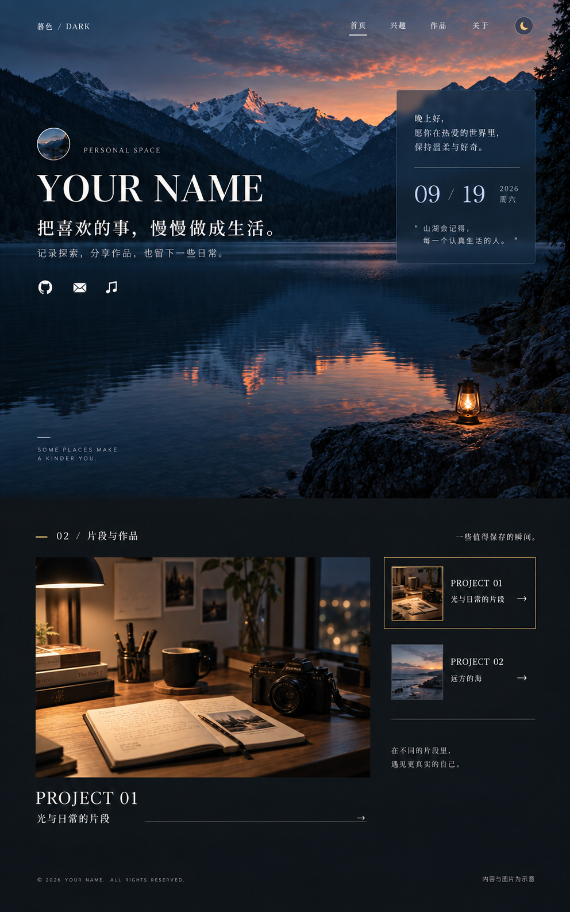
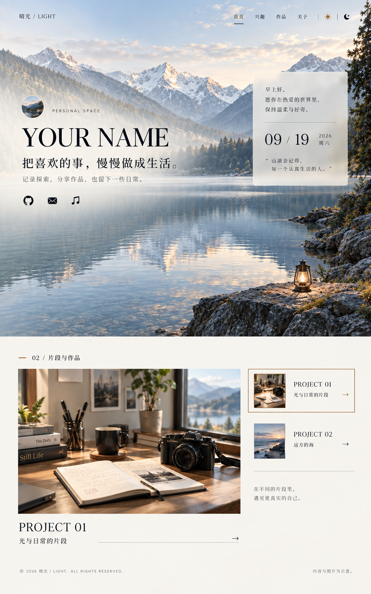

# 个人主页总体风格设计

日期：2026-09-19。状态：视觉方向已由用户确认；首版页面已按本文与后续两份文档实现，深浅主题、画廊与响应式布局可通过本地预览检视，色值与参数以实现为准并随实测微调。

本文定义页面的视觉语言、排版规则和双主题表现。[项目设计方案](./02-项目设计方案.md)定义内容组织与实施边界，[实现手段与具体细节](./03-实现手段与具体细节.md)定义数据、组件行为和工程验收。发生歧义时，视觉以本文为准，范围以项目方案为准，接口与状态以实现细节为准；跨领域调整应同步相关文档。

## 1. 设计定位与已确认方向

主页是一个展示个人气质、兴趣和作品的数字空间。访客进入时先通过风景、姓名和简短文字建立印象，再向下浏览兴趣与精选项目，最后找到个人介绍和联系方式。信息表达保持自然，文案使用真实经历；尚未提供的内容明确作为演示占位。

用户已确认采用 A 的全幅风景首屏和局部毛玻璃信息面板，后续采用 C 的大图画廊与侧边条目选择。深色模式和浅色模式均为完整设计目标，共享信息结构、栏目顺序和操作习惯。

深色模式称为“暮色”：蓝调暮光、少量暖色光源、深色玻璃和炭黑画廊共同形成安静的浏览氛围。浅色模式称为“晴光”：晨光风景、透亮玻璃、暖白画廊和深色文字形成清晰舒展的阅读环境。这两个名称是设计内部称呼，网站品牌和真实姓名仍由后续内容决定。

## 2. 视觉基准图

### 暮色：深色模式

### 晴光：浅色模式

两张图由内置 imagegen 生成，用于确认构图与气氛。图片中的姓名、日期、引言、项目文字、图标以及摄影内容都是示意；正文的定义优先于生成图中的细小字形或装饰。概念图只展示首屏与代表性画廊，正式页面还应有独立的兴趣、项目及关于章节。整张效果图不能作为网页背景替代真实可访问的页面元素。

## 3. 页面构图

### 首屏：风景中的个人入口

首屏使用铺满容器的真实风景图片。桌面端文字组位于左侧，包含可选头像、小型身份标识、个人姓名、主张式短句、补充说明和少量社交入口；右侧只保留一个有明确用途的玻璃面板，呈现设备本地日期与简短问候。主要内容垂直居中，画面中的天空、山体、水面保留足够空间，不把图片压缩为装饰缩略图。

桌面宽度至少 1024px 时，左右布局建议约为 60% 与 28%，剩余作为呼吸空间。首屏最小高度使用动态视口单位配合回退值，内容超出时允许页面自然增高。短屏下先减少纵向留白，再将面板下移，不通过压低字号强制挤入一屏。

姓名与正文直接构建为文本。深色主题在文字附近增加暗色局部遮罩，浅色主题增加柔和的暖白局部遮罩；遮罩服务于可读性，风景主体区域保持细节。浅色首屏继续采用全幅图片，不改变为白底左右图片拼贴。壁纸的焦点分别为桌面与移动端配置，避免移动裁切后遮挡文字或丢失景物主体。

### 后续章节：大图与条目联动的画廊

兴趣与项目为两个独立章节，共享画廊视觉语言，但使用不同数据。桌面主预览占内容宽度约 68%，右侧列表约 28%，中间留出稳定间距。每个章节由小型编号、章节名称、简短导语、主图、图片说明和可操作条目组成。章节编号依据实际可见章节连续生成。

主图承担视觉主体，条目侧栏使用缩略图、名称和一行说明。选中项使用细边框或短强调线、明确文字层级和状态标记共同提示，不仅依赖颜色。项目技术说明、访问链接与源码链接放在对应内容面板中，以必要的信息支持访客判断，不堆砌统一技能标签。

照片允许在指定比例内裁切；软件截图、图表和其他需要保留边缘信息的媒体使用完整显示，周围填充当前主题的背景色。主题切换不会改变作品的实际截图和事实内容。兴趣摄影可以另外提供明暗版本，但只有真实存在且指向同一内容时才使用；首屏允许使用同一景物的晨昏主题配图。

### 导航与页尾

顶部导航包括首页、兴趣、作品、关于和主题控制。导航在首屏采用低干扰的透明样式，进入正文后提供足够不透明的主题背景；文字与图标始终满足对比度要求。移动导航展开后可通过 Escape 关闭，关闭时回到触发按钮。

关于章节简短交代身份、关注方向和联系方式。页尾只保留版权、必要链接和主题入口等少量信息。社交、音乐或联系地址缺失时，相关入口不渲染，不以空链接填补版面。

## 4. 颜色与材质

下表是建议使用的语义色值。半透明面板的实际对比度取决于其下方图片，不能只根据名义色值判断达标。

| 语义 | 暮色 | 晴光 | 使用位置 |
| --- | --- | --- | --- |
| 页面背景 | `#15191d` | `#f7f5f0` | 正文与页尾 |
| 次级表面 | `#1d242b` | `#fffdf8` | 图片加载回退、展开内容 |
| 主文字 | `#f2eee6` | `#242a2c` | 标题与正文 |
| 次级文字 | `#b2b9bf` | `#646967` | 图注、辅助说明 |
| 强调色 | `#d2ad72` | `#875b2d` | 当前条目、短线、状态 |
| 分隔线 | `#39434d` | `#d8d5cf` | 装饰性边界，不单独表示状态 |
| 玻璃底色 | `rgba(18,30,44,.72)` | `rgba(255,253,247,.82)` | 首屏日期面板 |
| 焦点描边 | `#e6c58e` | `#68451f` | 键盘聚焦，实测后微调 |

按 sRGB 相对亮度公式计算，上表主文字、次级文字和强调色在对应纯色页面背景上的对比度依次为：暮色 15.27:1、8.90:1、8.38:1；晴光 13.36:1、5.13:1、5.41:1。这只验证六组纯色组合，不代表图片叠层、玻璃或全部交互状态已达标。对比度目标依据 [W3C 对比度说明](https://www.w3.org/WAI/WCAG22/Understanding/contrast-minimum.html)。

玻璃材质仅用于首屏面板和必要的浮动导航，建议模糊半径 16–24px，边框 1px。正文以清晰图文为主，避免多个模糊层同时覆盖大面积画布。浏览器不支持背景模糊时，提高底色不透明度，继续保证文字清楚。

图片边框保持方正或最多 4px 圆角，玻璃面板建议 10px，轻量控件建议 6px。大图不叠加强烈投影；浅色模式允许微弱接触阴影。深浅模式的阴影、遮罩、边框、控件状态和图片曝光应分别检查。

## 5. 字体、间距与信息密度

个人英文名称可采用衬线展示字体，中文主标题可使用适度的宋体气质；正文和导航使用清晰的中文无衬线字体，数字与章节编号可用等宽字体。默认先使用系统字体栈，正式字体在确认授权与性能预算后按需本地化。文字必须可选择、可缩放，并保持合理字体回退。

| 元素 | 桌面建议 | 手机建议 |
| --- | --- | --- |
| 个人姓名 | 64–96px，随长度缩放或换行 | 40–56px，允许自然换行 |
| 首屏短句 | 26–34px | 22–28px |
| 章节标题 | 28–40px | 24–30px |
| 正文 | 16–18px | 16px |
| 图注与辅助标签 | 13–14px | 不低于 12px |
| 正文行高 | 1.6–1.8 | 1.65–1.85 |
| 正文内容最大宽度 | 1280px | 容器宽度减两侧边距 |
| 页面两侧边距 | 48–80px | 20–24px；320px 窄屏可为 16px |

间距使用 4、8、12、16、24、32、48、64、96px 的基础序列。章节间建议 80–120px，并随视口收敛。长标题优先换行，外链长地址允许断行，不截掉关键项目名称。真实内容补充后再根据阅读长度微调，而不是要求内容迁就生成图。

## 6. 双主题与交互状态

主题设置提供“跟随系统、浅色、深色”三项，首次访问默认跟随系统，手动偏好保存在本地。图中的太阳或月亮是入口示意，正式控件应让三种偏好都有清晰可达的操作。切换时保留当前章节、图库选中项、焦点和滚动位置。背景图尚未加载时使用对应主题的纯色或渐变回退，不能闪出不匹配的高亮背景。

作品条目以点击和键盘作为可靠操作，桌面悬停可作为增强预览。悬停不能意外移动键盘焦点，触屏首次点击直接选择项目；进入外部网站由独立链接完成。图片区为空时显示有边界的说明区域，不展示破损图片图标。

动效以 160–240ms 的控件反馈、240–360ms 的主题颜色过渡、350–550ms 的图片交叉淡入为起点；入场位移不超过 12px。首版不做全屏加载动画、自动循环壁纸或滚轮劫持。开启减少动态效果后取消入场位移、平滑滚动与交叉淡入，直接呈现终态。所有这些时间是设计建议而非测量结果。

## 7. 响应式与可访问性

使用 640px 与 1024px 作为主要断点。至少 1024px 保持双栏；640–1023px 首屏可以缩小右侧面板或移至文字下方，画廊根据内容改为上下排列；小于 640px 采用单列，作品选择器与当前图文保持明确关联。小屏内容完整可读，不隐藏项目详情来维持视觉高度。

移动端自然滚动，桌面如使用章节吸附，只允许 proximity 形式并确保超高内容可正常阅读。点击或触摸目标至少 44×44 CSS px。普通文字对比度目标至少 4.5:1，大字号至少 3:1；焦点、控件边界与选中状态另行检查。导航不遮挡锚点标题，页面提供跳到主要内容入口，装饰壁纸不重复朗读。

## 8. 视觉验收与素材约定

开发验收至少覆盖 1440、1024、768、390、320px 宽度，并分别检查深浅模式、短屏和 200% 缩放。首屏应保留风景主导的构图，文字区域实测可读；画廊应保留主图与侧栏的层级；移动端不可出现横向溢出、被裁切的说明或依赖悬停才能访问的内容。截图比较允许真实图片与占位素材不同，但不允许丢失已确认的布局关系。

首屏桌面图建议控制在 350KB 内、手机图在 180KB 内，作为初始资源预算；图片质量与压缩结果需实测权衡。概念稿 PNG 仅为文档参考，生产站应使用单独的压缩图片资源。LCP、CLS、键盘导航和深浅主题对比度均须在实现后检测，不以效果稿替代验证。

后续内容输入包括显示名称、头像、首屏短句、两至三个兴趣主题、精选项目的图文及链接、个人简介和联系方式。所有资料可逐步替换，不改变整体布局契约。示意山湖、书桌和相机不代表用户真实兴趣，也不据此编写个人经历。

## 9. 参考来源

风格参考为 [imsyy/home](https://github.com/imsyy/home) 的个人入口表达与 [Qiongkura](https://qiongkura.xyz) 的分章节展示。此处总结基于本任务此前已完成的页面及源码检查，未在文档编写日重新核查这两个网站。设计结果以本地深浅概念稿及本文规范为开发依据。
