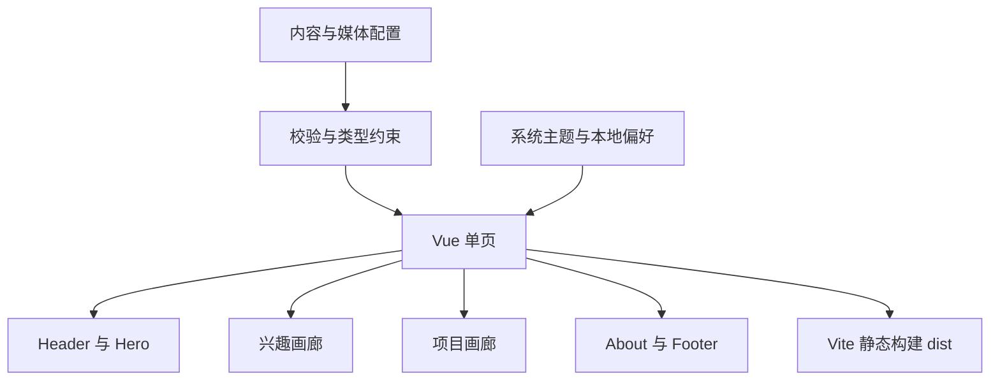

# 个人主页项目设计方案

日期：2026-09-19。首版已按本文实现：静态单页、深浅双主题、四个内容锚点与两组画廊可运行，页面内容与媒体为演示占位，待真实资料替换。

本项目建设一页式个人主页，让初次到访者先感受沉浸式风景氛围，再沿着兴趣、项目与自我介绍了解其人和作品。已确认的视觉方向是全幅壁纸首屏，后续以画廊方式展示内容；深色与浅色模式都须形成完整、同等用心的体验。[深色效果稿](assets/home-dark-concept.png)与[浅色效果稿](assets/home-light-concept.png)中的山湖用于校准氛围和层次，不代表用户真实经历，具体照片、个人信息与作品材料仍待提供。视觉规范见[总体风格设计](./01-总体风格设计.md)，字段与行为契约见[实现手段与具体细节](./03-实现手段与具体细节.md)。本文描述首版产品与工程方案；技术栈、目录和性能预算是实施建议，须在开发开始时结合真实素材核定。

## 访问路径与范围

访客进入页面时先看到山湖主视觉、姓名或占位标题和简短引导；向下自然滚动，依次浏览兴趣画廊、项目画廊和关于部分，最后在页脚找到已核验的联系入口。导航锚点固定为 `#home`、`#interests`、`#projects`、`#about`，既支持页内跳转，也使复制后的链接能直达章节。兴趣表达生活取向，项目展示可核实的作品，两类内容分章维护，避免把爱好误读成项目成果。主题切换始终保留当前位置及画廊状态；移动端遵循自然滚动，桌面端可酌情使用 `proximity` 吸附，但滚轮操作不得被拦截。

首版范围为静态单页、响应式布局、深浅双主题、四个内容锚点、两组画廊、关于信息、可选的外部链接与必要的无障碍交互。媒体以照片为主；只有取得音频文件并明确展示意图时，才提供由访客主动启动的播放器。页面可以显示设备本地日期，但日期不暗示访客所在地或特定时区。首版不接天气或其他第三方 API，不建立账号、后台、留言、数据库和数据分析；这些能力既无现阶段内容依据，也会增加维护与隐私负担。

内容补充以一份资料清单为准：个人称呼、短句介绍、较完整的自述、可公开的联系渠道；每项兴趣的标题、说明、照片、替代文本及必要署名；每个项目的名称、角色、时间、背景、成果、截图与经确认的发布链接；首屏深浅两张山湖图及版权或使用许可。项目链接可空，空值时隐藏按钮，不生成 `#` 或虚构网址。无素材的条目不进入画廊；整章无可展示条目时暂不渲染该章，并从导航移除相应入口。音频缺失时隐藏播放器，联系资料缺失时隐藏对应入口。开发预览可以使用清楚标记的编辑占位文案与效果稿，但公开发布前须替换并核验，不让占位项目被误当作真实履历。

## 页面与工程结构

建议采用 Vue 3、TypeScript、Vite 和原生 CSS，构建为 `dist` 中的纯 SPA 静态文件。选择它们是为了让主题、图库状态和内容配置各有清晰边界，同时保持部署简单；本页规模暂不需要 Router、Pinia、大型 UI 库或 GSAP。依赖使用 npm 与 `package-lock.json` 锁定，实际版本在启动开发时从官方兼容信息核定，不在方案中预填版本号。Vue 和 Vite 的官方入门文档分别见 [Vue Guide](https://vuejs.org/guide/introduction.html) 与 [Vite Guide](https://vite.dev/guide/)（2026-09-19 查阅）；首版不做完整 SEO 预渲染。

`Header` 提供锚点导航和 `ThemeSwitch`；`Hero` 承载山湖图与首屏文字；`InterestGallery`、`ProjectGallery` 各自决定内容语义，共用 `GallerySection.vue` 的展示与键盘交互；`AboutSection` 管理自述与已确认的联系入口；`Footer` 放置简要收尾信息。首版内容集中在 `src/content/site.ts`，类型置于 `src/types/content.ts`，纯逻辑检查置于 `src/content/validate.ts`。这里只约定“站点信息、主题首屏图、兴趣、项目和可选链接”等概念，字段、合法值及校验细节以《实现手段与具体细节》为准。内容图在主题间保持一致，主题只改变配色及首屏对应图，不改写项目截图。

| 目录或文件 | 责任 |
| --- | --- |
| `src/components/` | 页面模块及可复用图库、主题开关的视图和交互。 |
| `src/content/site.ts` | 编辑者可维护的首版静态文案、条目与资源引用。 |
| `src/types/content.ts`、`src/content/validate.ts` | 内容类型与无副作用校验，阻止明显缺漏进入发布构建。 |
| `src/styles/` | 设计变量、响应式布局、主题和减少动态效果的样式。 |
| `public/` | 已授权且经过压缩的静态媒体；源文件与署名信息需可追溯。 |
| `tests/` | 主题与配置纯函数测试、关键路径的浏览器检查。 |
| `docs/assets/` | 方案效果稿，仅用于设计说明。 |

主题偏好分为跟随系统、浅色、深色三态，默认跟随系统；只有在跟随系统时才响应设备主题变化。偏好写入 `localStorage` 的 `personal-home:theme`，读取或写入失败时页面继续正常显示。画廊在触屏上可点击，在键盘上遵循 tabs 模式，以方向键、`Home`、`End` 在标签间移动，每次只显示当前面板。纯 SPA 的无脚本降级限于 `index.html` 内的静态说明与联系入口，不承诺无脚本浏览完整图库。动画遵守 `prefers-reduced-motion`，焦点、对比度和图像说明与视觉氛围同时设计。

## 交付与验收

工作分为结构与视觉原型、交互完善、真实内容替换、发布核验四个阶段。原型阶段使用明确标记的演示数据，完成四章结构、深浅主题、响应式和静态构建；交互阶段加入图库键盘行为、图片加载策略与必要测试。内容收集可与前两阶段并行，不要求用户先补齐资料。真实内容替换阶段核定公开范围，替换首屏图、兴趣与项目素材；发布核验阶段再检查链接、版权、替代文本、两套主题及各视口截图。开发开始后，每阶段以可在本地查看的页面与内容清单交付，资料缺失不得被虚构经历掩盖。

| 阶段 | 可验收产出 | 开始条件 |
| --- | --- | --- |
| 结构与视觉原型 | 演示内容下的四章页面，深浅主题与五档宽度可浏览 | 当前三份设计文档与可使用的示意素材 |
| 交互完善 | 主题记忆、图库键盘与触屏、失败回退通过检查 | 页面结构与内容契约已落实 |
| 真实内容替换 | 已核验的真实资料与对应媒体，缺项按空态规则处理 | 用户逐步提供实际资料 |
| 发布核验 | 构建产物、检查记录与选定部署配置 | 内容已核定，部署目标已确定 |

验收覆盖 1440、1024、768、390、320 像素宽，尤其检查约 `390×844` 的移动视口；断点建议设为 640 与 1024 像素，内容高度自然增长，不强压每章占满一屏。普通文本以 WCAG AA 4.5:1、大字 3:1 为目标。移动 LCP 不高于 2.5 秒、CLS 不高于 0.1、INP 不高于 200 毫秒是待实测目标；真实用户 INP 不能用 Lighthouse 的一次实验室结果替代。首屏图可先按桌面不高于 350 KB、移动不高于 180 KB 设资源预算，随后依据画质、格式和实测调整。验证顺序为类型检查、构建、Vitest 对主题与配置纯函数的单测、Playwright 对导航/主题/图库的必要端到端检查，以及深浅两种模式的截图复核。

主要依赖是真实照片与文字、图片使用权、已确认的项目链接和目标部署环境。照片若未准备好，可完成结构与交互验证，但无法对最终首屏的裁切和速度作结论；图片许可或外链状态不明时不得公开对应材料。发布前应将草稿站设置为禁止索引，并在公开前复核站点标题、描述、分享图、所有可见内容及链接；正式发布时再明确索引策略与部署地址。此方案只规定可执行的页面行为与验收方式，当前不包含建站、安装依赖或发布操作。
